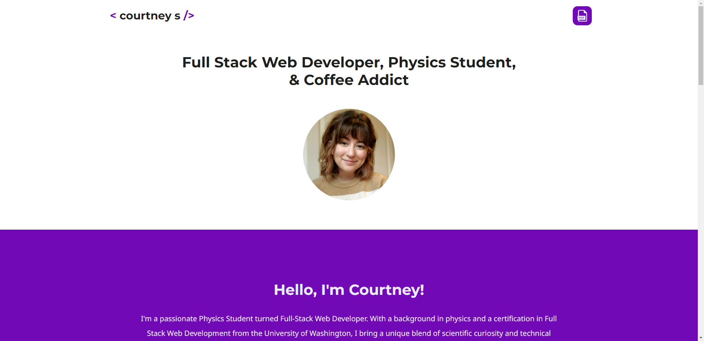

# react-portfolio

## Description

This project was to create a portfolio using React. This project also features Bootstrap as a CSS framework. This webpage provides information about me, current projects, my resume, and contact methods.

This app uses:

- React
- Bootstrap

## Table of Contents

- [Startup](#startup)
- [Appearance](#appearance)
- [License](#license)
- [Questions](#questions)

## Startup

`npm install`

`npm run start`

## Appearance

You can launch the deployed site [here](https://struelensc.github.io/react-portfolio/).

## License

See the [LICENSE](LICENSE.md) file for license rights and limitations (MIT License).

## Questions

Feel free to reach me on [GitHub](https://github.com/struelensc).
